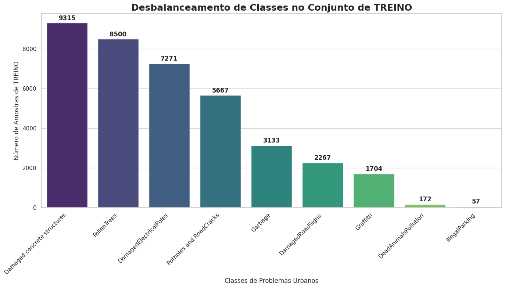
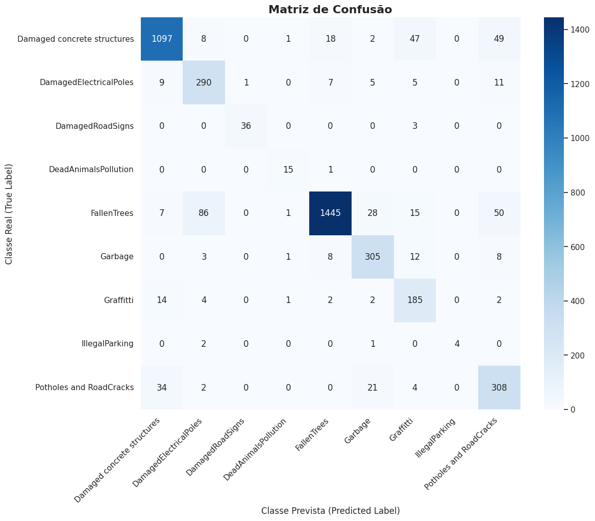
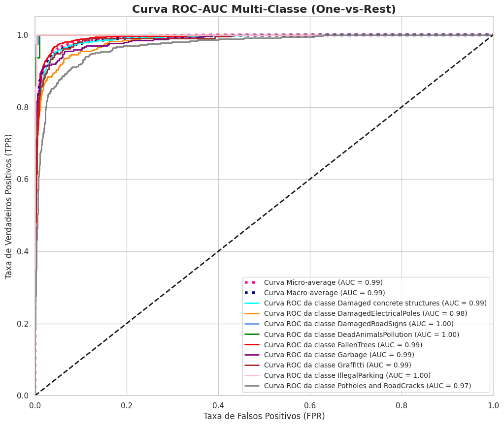

# Urban-Eye (Classificador de Problemas Urbanos)

Este repositório contém o pipeline de treinamento para o "Urban-Eye", um classificador de problemas urbanos baseado em Visão Computacional. O objetivo é utilizar imagens (capturadas por cidadãos) para identificar e classificar automaticamente problemas como buracos, lixo e postes danificados, visando otimizar a resposta de serviços públicos.

---

## Tópicos

- [Descrição do Projeto](#descrição-do-projeto)
- [Metodologia e Análise de Dados](#metodologia-e-análise-de-dados)
- [Análise Exploratória (EDA)](#análise-exploratória-eda)
- [Tratamento do Desbalanceamento de Classes](#tratamento-do-desbalanceamento-de-classes)
- [Escolha do Modelo (Transfer Learning)](#escolha-do-modelo-transfer-learning)
- [Considerações sobre K-Fold Cross-Validation](#considerações-sobre-k-fold-cross-validation)
- [Ferramentas Utilizadas](#ferramentas-utilizadas)
- [Resultados](#resultados)
- [Como Usar este Repositório](#como-usar-este-repositório)
- [Autor](#autor)

---

## Descrição do Projeto

O desafio deste projeto era desenvolver um assistente inteligente capaz de classificar imagens de problemas urbanos em 9 categorias distintas. O modelo foi treinado em um [dataset público do Kaggle](https://www.kaggle.com/datasets/akinduhiman/urban-issues-dataset) e utiliza uma arquitetura de Rede Neural Convolucional (CNN) moderna para alcançar ótimos resutados.

## Metodologia e Análise de Dados

O foco do projeto não foi apenas obter uma boa acurácia, mas seguir um processo de ciência de dados robusto e autônomo.

### Análise Exploratória (EDA)

A primeira etapa foi uma Análise Exploratória de Dados (EDA) profunda:

1.  **Mapeamento de Dados:** Crei um `pandas.DataFrame` que mapeava o caminho (`filepath`) de cada imagem, sua classe (`label`) e seu conjunto (`split` - train/valid/test).
2.  **Visual Sanity Check:** Inspecionei amostras aleatórias de cada classe. Confirmamos que as imagens eram nítidas, variadas (não apenas ângulos diferentes do mesmo problema) e correspondiam corretamente aos seus rótulos.
3.  **Descoberta Crítica: Desbalanceamento:** A principal descoberta da EDA foi um **severo desbalanceamento de classes**. Identifiquei que classes como `Damaged concrete structures` e `FallenTrees` possuíam milhares de imagens enquanto classes como `IllegalParking` e `DeadAnimalsPollution` tinham muito poucas (menos de 200)m o que seria algo mais crítico para o projeto.

### Tratamento do Desbalanceamento de Classes

Esse desbalanceamento foi o principal desafio técnico. Um modelo treinado nesses dados "crus" aprenderia rapidamente a ignorar as classes raras. Para combater isso, implementei uma estratégia dupla:

1.  **Data Augmentation (`ImageDataGenerator`):** Apliquei um conjunto de transformações *apenas no conjunto de treino*. Isso "cria" novas imagens sintéticas, mas realistas. As transformações escolhidas foram:
    * Inversão Horizontal (`horizontal_flip=True`)
    * Rotação Aleatória (`rotation_range=20`)
    * Zoom Aleatório (`zoom_range=0.15`)
    * Mudança de Brilho (`brightness_range=[0.8, 1.2]`)
2.  **Pesos de Classe (`class_weight`):** Usei a função `compute_class_weight` do `scikit-learn` (no modo `balanced`) para calcular um "peso" para cada classe. Esse dicionário de pesos foi passado ali no `model.fit()`, ajudando o modelo a prestar mais atenção e penalizando-o bastante por erros cometidos nas classes raras.

### Escolha do Modelo (Transfer Learning)

Aqui haviam duas abordagens: treinar do zero ou usar Transfer Learning.

* **Decisão:** Optei por **Transfer Learning** para melhorar o conhecimento de modelos pré-treinados em milhões de imagens (ImageNet) e obter um desempenho melhor e superior com menos tempo de treino.
* **Arquitetura:** Escolhi o **`MobileNetV2`** por seu bom equilíbrio entre eficiência (rápido para treinar no Kaggle) e capacidade de classificação.
* **Implementação:**
    1.  Carreguei o `MobileNetV2` com `weights='imagenet'` e `include_top=False` (para "decapitar" o modelo).
    2.  Congelei (`.trainable = False`) todas as camadas do `base_model` para preservar o conhecimento da ImageNet.
    3.  Adicionei minha própria "cabeça" de classificação: `GlobalAveragePooling2D` (para reduzir a dimensionalidade), `Dropout(0.5)` (para combater overfitting) e uma camada `Dense(9, activation='softmax')` (a camada final de 9 neurônios).

### Considerações sobre K-Fold Cross-Validation

Pensei tbm no uso de K-Fold Cross-Validation para uma avaliação mais robusta. Embora o K-Fold seja uma técnica excelente (especialmente o `StratifiedKFold` para dados desbalanceados e eu particularmente gostar muito de usar esse método), decidi não implementar nesse momento... 

* **Motivo:** O K-Fold aumentaria o custo computacional em N vezes (ex: 5x para 5 folds). A parte do desbalanceamento seria um ponto crítico para cuidar também além de que os "poderes" disponíveis do Kaggle são bem limitados, e esse método tende a deixar o treinamento muito mais complexo.
A estratégia adotada foi focar na "abordagem simples primeiro": usar a divisão fixa `train`/`valid`/`test` fornecida pelo dataset para iterar rapidamente, construir um *pipeline* funcional e obter um *baseline* robusto. O K-Fold é um excelente "próximo passo" para validar a generalização do modelo final.

## Ferramentas Utilizadas

* **Linguagem:** Python 3
* **Bibliotecas Principais:**
    * TensorFlow & Keras (para construção e treino do modelo)
    * Pandas (para manipulação do `DataFrame` mestre)
    * Scikit-learn (para `compute_class_weight`)
    * Matplotlib & Seaborn (para visualização de dados)
    * NumPy (para operações de array)

## Resultados

O modelo foi avaliado no conjunto de teste (`test_gen`), que não foi usado em nenhuma etapa do treinamento ou ajuste.

**Métricas no Conjunto de Teste:**
* **Acurácia (Accuracy):** `0.0001`
* **Perda (Loss):** `0.3509]`
* **Precisão (Precision):** `0.9010]`
* **Recall (Recall):** `0.8752`

## Como Usar este Repositório

1.  **`urban-eye-an-urban-issue-ai-classifier.ipynb`**: Este notebook Jupyter contém todo o processo, desde a Análise Exploratória de Dados até a criação do pipeline, definição da arquitetura, treinamento e avaliação do modelo. Ele também está simples de ser acessado pelo Kaggle (link abaixo)
2.  **`best_model.keras`**: O arquivo do modelo treinado, salvo pelo callback `ModelCheckpoint`.

## Autor

Vinícius Santos Monteiro
* [GitHub - Projeto Urban_Eye](https://github.com/vini-mon/Urban_Eye)
* [Kaggle - Projeto Urban_Eye](https://www.kaggle.com/code/viniciusjamal/urban-eye-an-urban-issue-ai-classifier)
* [LinkedIn](https://www.linkedin.com/in/vinicius-santos-monteiro-a3a88a1aa/)